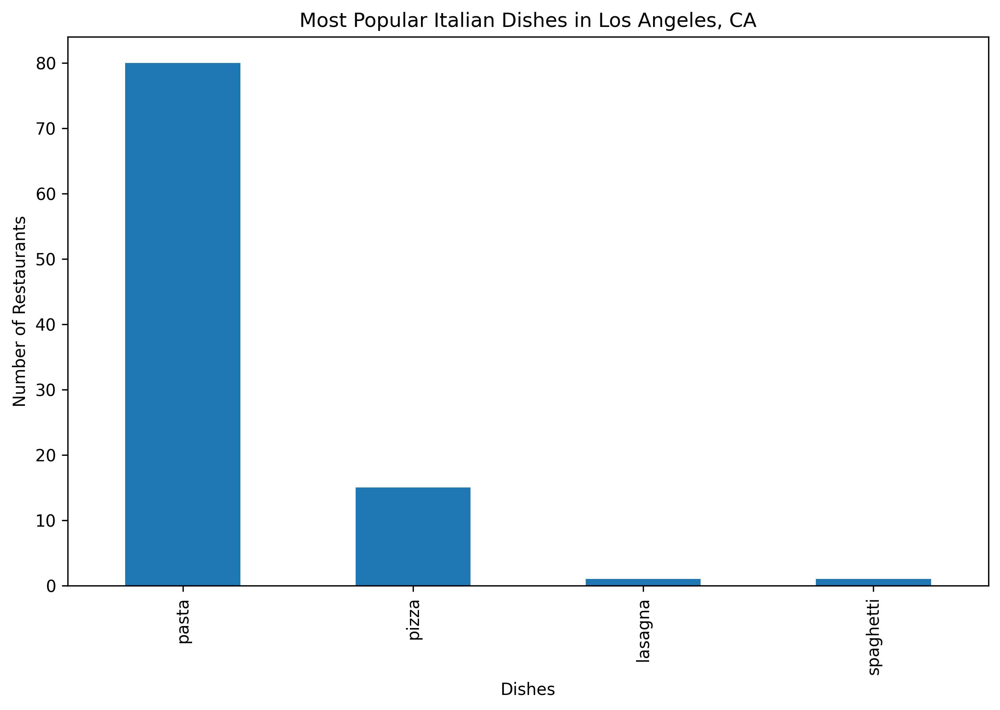
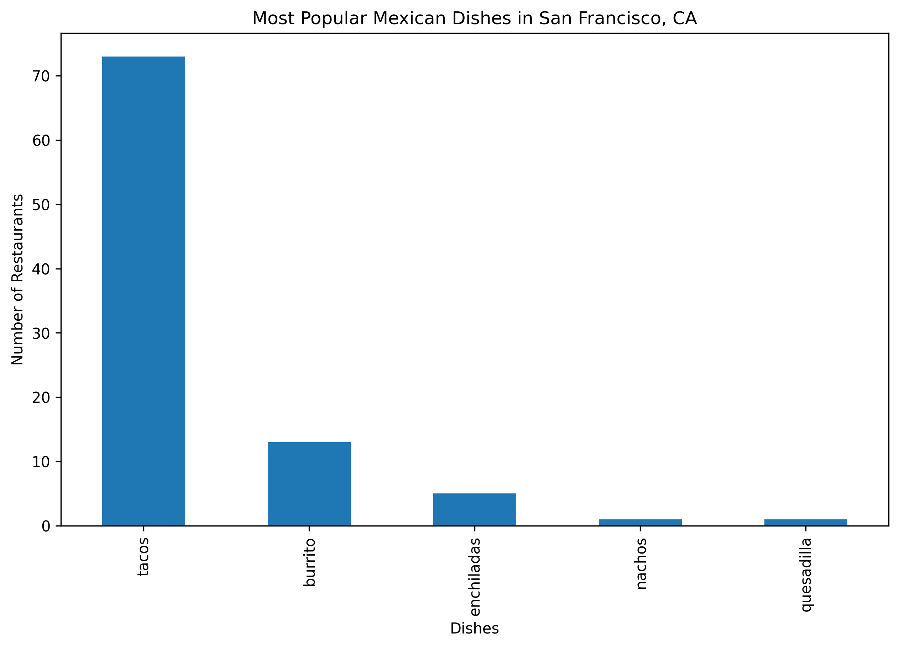

# Food Delivery Data Science Project

## Overview
This project analyzes Yelp restaurant reviews to identify the most popular dishes for specific cuisines in a given city. It leverages the Yelp API to collect review data, applies natural language processing (NLP) techniques such as sentiment analysis and dish detection, trains a multi-label classifier to predict dish mentions in reviews, and visualizes the results with bar charts.

## Objectives
- Fetch restaurant reviews from Yelp for a specified city and cuisine.
- Perform sentiment analysis on the reviews using VADER.
- Detect mentions of predefined dishes in the reviews.
- Determine the most frequently mentioned dish per restaurant.
- Train a multi-label classifier to predict dish mentions in reviews.
- Visualize the most popular dishes across restaurants.

## Technologies Used
- **Programming Language**: Python 3.8+
- **Libraries**:
  - `requests`: For making API calls to Yelp.
  - `pandas`: For data manipulation and storage.
  - `numpy`: For numerical operations.
  - `scikit-learn`: For machine learning (vectorization, model training, and evaluation).
  - `nltk`: For sentiment analysis using VADER.
  - `matplotlib`: For creating visualizations.
- **API**: Yelp API for collecting restaurant and review data.

## Setup Instructions
1. **Install Python**: Ensure Python 3.8 or higher is installed on your system. Download it from [python.org](https://www.python.org/downloads/) if needed.
2. **Clone or Download**: Clone this repository or download the project files to your local machine.
3. **Create a Virtual Environment** (recommended):
   ```bash
   python -m venv venv
   ```
4. **Activate the Virtual Environment**:
   - **Windows**:
     ```bash
     venv\Scripts\activate
     ```
   - **macOS/Linux**:
     ```bash
     source venv/bin/activate
     ```
5. **Install Required Packages**:
   ```bash
   pip install requests pandas numpy scikit-learn nltk matplotlib
   ```
6. **Obtain a Yelp API Key**:
   - Sign up for a Yelp Developer account at [yelp.com/developers](https://www.yelp.com/developers).
   - Create an app to get your API key.
   - Replace `YOUR_API_KEY_HERE` in `food_delivery_analysis.py` with your actual API key.

## Usage
Run the script from the command line, providing the desired location and cuisine as arguments. The script processes one cuisine at a time.

### Examples
- **Analyze Italian restaurants in Los Angeles**:
  ```bash
  python food_delivery_analysis.py --location "Los Angeles, CA" --cuisine Italian
  ```

- **Analyze Mexican restaurants in San Francisco**:
  ```bash
  python food_delivery_analysis.py --location "San Francisco, CA" --cuisine Mexican
  ```

To analyze multiple cuisines, run the script separately for each cuisine.

### Notes
- The script is flexible, allowing you to specify different cities and cuisines via command-line arguments.
- Ensure your Yelp API key is correctly set in the script to avoid authentication errors.

## Outputs
The script generates the following files in the main project directory:
- **`{cuisine}_reviews.csv`**: Contains review data with sentiment scores and binary indicators for dish mentions.
- **`{cuisine}_best_selling_dishes.csv`**: Lists the best-selling (most frequently mentioned) dish for each restaurant.
- **`{cuisine}_best_selling_dishes.png`**: A bar chart visualizing the frequency of the most popular dishes across all restaurants for the specified cuisine.

Additionally, the console output includes the F1-score (micro-averaged) for the machine learning model's performance in predicting dish mentions.

### Example Output Files
For Italian cuisine in Los Angeles:
- `Italian_reviews.csv`
- `Italian_best_selling_dishes.csv`
- `Italian_best_selling_dishes.png`


## Screenshots
Here are some example outputs from the food delivery analysis:

- **Italian Cuisine in Los Angeles**:  
  

- **Mexican Cuisine in San Francisco**:  
  
